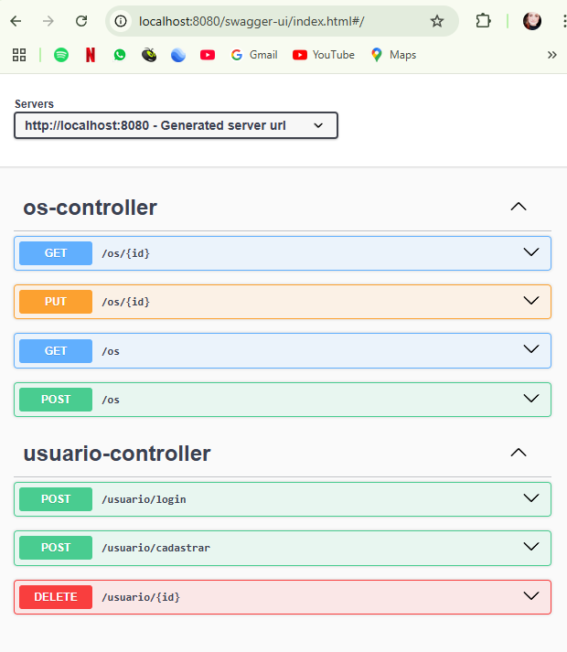
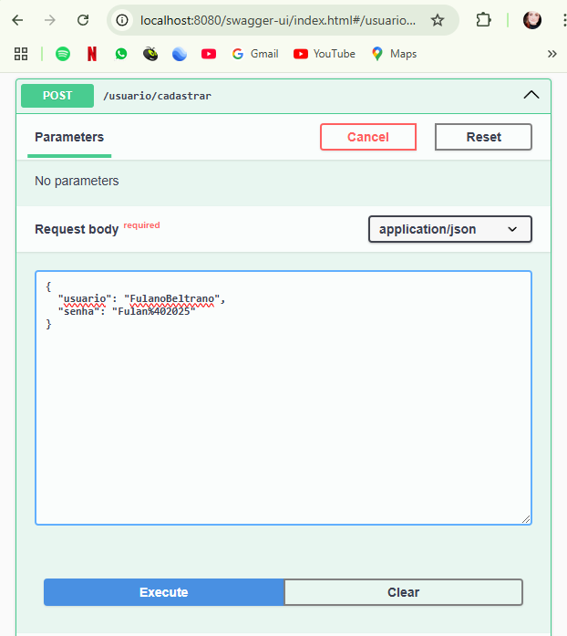
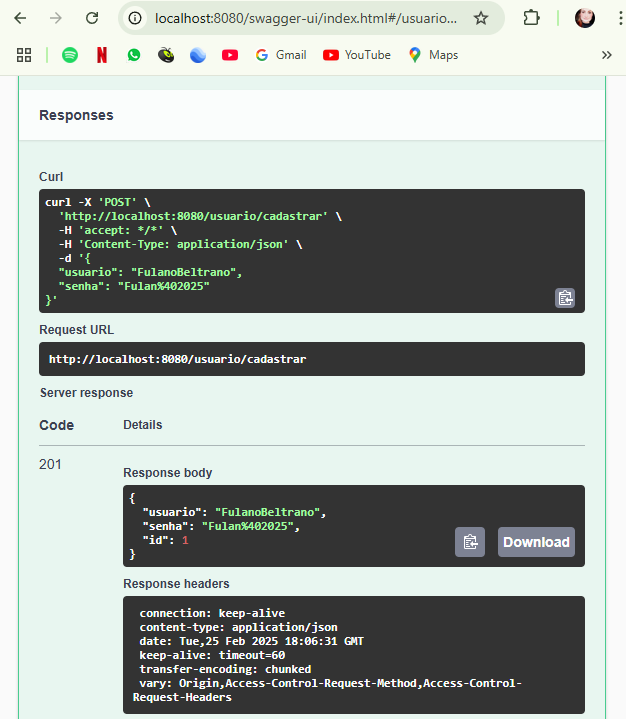

# MyAssist backend 

Backend automation of an web app for an technical assistance enterprise.

## Labels

- [Java 17](https://www.java.com/pt_BR/ "Java")
- [Spring Boot](https://spring.io/projects/spring-boot "Spring Boot")
- [H2 Database Engine](https://www.h2database.com/html/main.html "H2 Database Engine")
- [Lombok](https://projectlombok.org/ "Lombok")

## Stack

**Back-end:** Java

## Functionalities

**USER-CONTROLLER**
- User generation for new employee (POST /usuario/login)
- Employee login to register service order (POST /usuario/cadastrar)
- User deletion for old employee (DELETE /usuario/{id})

**SERVICE ORDER-CONTROLLER**
- Registration of new service order (POST /os)
- Change of registered service order (PUT /os/{id})
- Search for all registered service orders (GET /os)
- Check service order registered by ID(GET /os/{id})

## Swagger

After run you can test APIs on swagger accessing http://localhost:8080/swagger-ui/index.html#/

**H2 database will reset after project stop running! **

## Autor

- [@nathterribile](https://github.com/nathterribile/AssistenciaTecnica-Backend)
